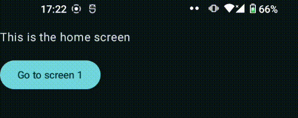
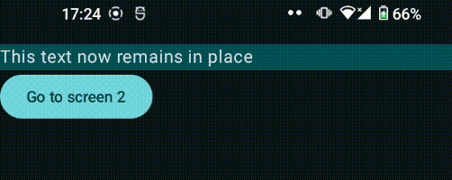

# androidx-navigation-shared-element-mre

This repository contains a **m**inimal **r**eproducible **e**xample for a bug related to `androidx.navigation:navigation-compose` and Shared Element Transitions.

The application wants to share a common topbar (represented with a `Box {}`) amongst two screens: `Screen1` and `Screen2`. This topbar contains some **static** text. The goal is to have this topbar remain in place, and animate/transition the rest of the screen below.

When navigating between these two screens, the text in the box briefly vanishes and reappears, but the box itself does not. The box is coloured differently to help see that it (correctly) remains in place.

Interestingly, **this only happens if Screen1 is not the startDestination of the navigation graph**. Changing the StartDestination from HomeScreen to Screen1 resolves this issue.

The starting location of the navigation graph shouldn’t have any impact on this, so my assumption is that this is related to the element not being present when first launching the app, but instead having to be created afterwards.

## Steps to reproduce

### Broken version

1. Launch the app. You will arrive on the Home Screen, as indicated by the text at the top of the screen
2. Navigate to Screen1 by clicking the button. You should see a topbar with some text appear.
3. Navigate to Screen2 by clicking the button. The text in the topbar will briefly vanish.
4. Navigate back to Screen1 by clicking the button or pressing the back button on your device. The text in the topbar will briefly vanish.
5. Repeat steps 3 & 4 to verify that the text indeed vanishes briefly.



### “Fix”ed version

1. In [MainActivity.kt](./app/src/main/java/io/github/stijndcl/mre/MainActivity.kt) on **line 41**, change the `startDestination` from `HOME` to `SCREEN1`:

   ```diff
   navController = navController,
   - startDestination = Destinations.HOME
   +startDestination = Destinations.SCREEN1
   ```

2. Launch the app. You will arrive on Screen1.

3. Navigate to Screen2 by clicking the button. The text in the topbar will remain in place.

4. Navigate back to Screen1 by clicking the button or pressing the back button on your device. The text in the topbar will once again remain in place.

5. Repeat steps 3 & 4 to verify that the text indeed remains in place now.

